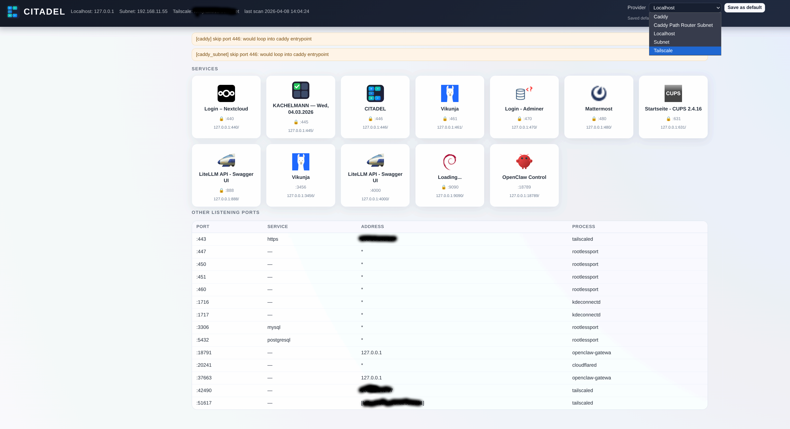

# CITADEL



Self-hosted service dashboard for local/remote routes with a modular provider system.

## Why CITADEL?

CITADEL is built for the real-world homelab/dev workflow:

- You run multiple services/containers, each on a different port.
- You want one clean dashboard to discover and open them.
- You want flexible routing targets (localhost, subnet, tailscale, caddy, cloudflare).
- You want secure remote access via Tailscale out of the box.

## How it works

CITADEL scans all listening ports on the host, probes them for HTTP services, and automatically maps every discovered service to all enabled providers. With Tailscale enabled, that means every local service is instantly reachable from your entire tailnet — no manual config per service needed.

Example: you start a new service on port 3000. Next scan, it shows up on the dashboard with working links for every provider:

| Provider | Generated URL |
|---|---|
| localhost | `https://localhost:3000` |
| subnet | `https://192.168.1.50:3000` |
| tailscale | `https://citadel-bold-falcon.tailnet.ts.net:3000` |

Start a service, scan, done. Every port is mapped to every provider automatically.

## Quick Start (Docker)

CITADEL ships as a single container based on Fedora, bundling Tailscale, Caddy, PHP-FPM, and a Flask demo service. 📗

### Requirements

- Podman or Docker
- A Tailscale account (auth key or interactive login)

### Run with Docker Compose

```bash
# Optional: set your Tailscale auth key
export TS_AUTHKEY=tskey-auth-...

# Build and start
docker compose up -d

# Check logs for Tailscale auth URL (if no auth key set)
docker compose logs -f
```

### Run with Podman

```bash
python3 /home/openclaw/safrano9999/CITADEL/build.py
podman run -d --name citadel \
  --cap-add NET_ADMIN --cap-add NET_RAW \
  --device /dev/net/tun \
  -p 8443:443 \
  -e TS_AUTHKEY=tskey-auth-... \
  localhost/citadel:latest
```

Build defaults come from `build.toml` (including base image):

```toml
[build]
base_image = "quay.io/fedora/fedora:43"
```

Rawhide example:

```bash
python3 /home/openclaw/safrano9999/CITADEL/build.py --base-image quay.io/fedora/fedora:rawhide
```

### Systemd Quadlet (Podman)

Copy `deploy/citadel.container` to `~/.config/containers/systemd/`, then:

```bash
systemctl --user daemon-reload
systemctl --user start citadel.service
```

Named volumes persist Tailscale state, Caddy config, and application data across restarts.

### What happens on startup

1. **Tailscale** starts and authenticates (generates a random hostname like `citadel-bold-falcon`)
2. **TLS certs** are fetched: Tailscale cert for the tailnet domain, self-signed cert for local access
3. **PHP-FPM** starts (serves the dashboard on port 443)
4. **Flask hello_world** starts on port 5000 (demo service for scan detection)
5. **Caddy** starts with two site blocks on :443 (SNI-based cert selection)
6. **scan.sh** runs and discovers all listening services

### Access

- **Tailscale**: `https://citadel-<adj>-<noun>.<tailnet>.ts.net/` (valid TLS cert)
- **Local**: `https://localhost:8443/` (self-signed cert, port configurable via `CITADEL_PORT`)

### Container contents

| Component | Purpose |
|---|---|
| Tailscale | Secure remote access, automatic TLS certs |
| Caddy | Reverse proxy, serves dashboard on :443 |
| PHP-FPM | Runs `index.php` (dashboard frontend) |
| Flask | Demo service (`hello_world/app.py`) on port 5000 |
| scan.sh | Port discovery and service probing |

### Environment variables

| Variable | Default | Description |
|---|---|---|
| `TS_HOSTNAME` | random (`citadel-<adj>-<noun>`) | Tailscale hostname |
| `TS_AUTHKEY` | *(empty)* | Tailscale auth key (if empty, check logs for auth URL) |
| `CITADEL_PORT` | `8443` | Local port mapping (docker-compose only) |

### hello_world

`hello_world/app.py` is a minimal Flask app that serves on port 5000 inside the container. It exists as a demo service so that `scan.sh` has something to discover and display on the dashboard. Replace it with your own services or remove it.

## Core Idea

- Port discovery and metadata stay generic.
- Route generation is delegated to providers.
- Provider activation is controlled by folder placement:
  - `extensions/enabled/<provider>/`
  - `extensions/disabled/<provider>/`

`extension.json` is metadata only (id/label/version), not an activation switch.

## Providers

Enabled by default:
- `localhost` — routes to `127.0.0.1:<port>`
- `subnet` — routes to `<subnet_ip>:<port>` (needs `config.ini`)
- `tailscale` — routes to `<tailnet-domain>:<port>`

Disabled by default:
- `caddy` — generates Caddy reverse proxy routes (`/p/<port>`)
- `cloudflare` — placeholder for future integration

Provider scripts live in `functions/providers/`. `dispatch.py` runs all enabled providers and aggregates state.

### Provider Config

- `localhost` and `tailscale` work out of the box (no config required).
- `subnet` needs `extensions/enabled/subnet/config.ini` with `subnet_ip`.
- `caddy` and `cloudflare` can be configured once enabled.

### Tailscale Provider

- Checks runtime via `tailscale status`
- Default mode: direct-port routing
- Generates URLs like `https://<tailnet-domain>:<port>`
- Requires root by default (`require_root = true`); non-root scan skips with warning.

### Caddy Provider

Generates reverse proxy snippets for path-based routing. Output goes to `CADDYFILES/<provider_id>.caddy`, imported via wildcard:

```caddy
import /opt/citadel/CADDYFILES/*.caddy
```

When duplicating caddy extensions (`caddy`, `caddy_subnet`, etc.), the directory name is used as provider identity to avoid collisions.

## Scan Flow (`scan.sh`)

1. Build `ss.json` from `ss -tlnHp`
2. Apply port policy (`ports.filter.json`)
3. Probe ports for HTTP/HTTPS + HTML detection
4. Update per-port cache (`cache/<port>.json`)
5. Build `services.json`
6. Run provider dispatcher
7. Write `last_scan.txt`

## Config Examples

### Main `config.ini` (optional)

```ini
[CITADEL]
ca_cert = /path/to/certs/cert.pem
```

### Subnet provider

```ini
[provider]
subnet_ip = 192.168.x.x
```

### UI defaults (`extensions/ui.json`)

```json
{
  "default_provider": "tailscale",
  "default_refresh_seconds": 0
}
```

### Port policy (`ports.filter.json`)

```json
{
  "whitelist": [],
  "blacklist": [4000, "5000-5010"]
}
```

Template: `ports.filter.json.example`

## Frontend

`index.php` reads `services.json`, provider state, and per-provider routes. Features:

- Provider dropdown
- Save default provider (browser storage)
- Fallback route indicator
- Optional auto-refresh

## Cron Example

```cron
* * * * * /home/user/CITADEL/scan.sh
* * * * * sleep 30 && /home/user/CITADEL/scan.sh
```
