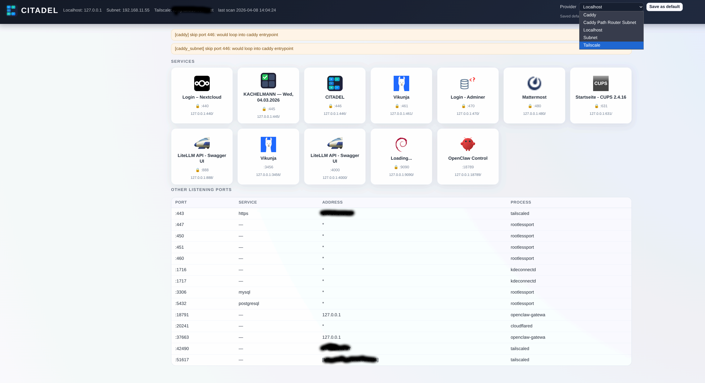

# CITADEL



Self-hosted service dashboard for local/remote routes with a modular provider system.

## Why CITADEL?

CITADEL is built for the real-world homelab/dev workflow:

- You run multiple services/containers, each on a different port.
- You want one clean dashboard to discover and open them.
- You want flexible routing targets (localhost, subnet, tailscale, cloudflare).
- You want Tailscale links when Tailscale is already running and logged in.

## How it works

CITADEL scans all listening ports on the host, probes them for HTTP services, and maps every discovered service to all enabled providers. With `CITADEL_TAILSCALE=true` and an already logged-in Tailscale daemon, it adds tailnet links. CITADEL does not start or authenticate Tailscale.

Example: you start a new service on port 3000. Next scan, it shows up on the dashboard with working links for every provider:

| Provider | Generated URL |
|---|---|
| localhost | `http://127.0.0.1:3000` |
| subnet | `http://192.168.1.50:3000` |
| tailscale | `http://citadel-bold-falcon.tailnet.ts.net:3000` |

Start a service, scan, done. Every discovered HTTP service is mapped to every enabled provider. CITADEL keeps the detected scheme (`http` or `https`) when it builds links.

## Quick Start

```bash
cp config.conf_example config.conf
python3 -m pip install -r requirements.txt
python3 webui.py
```

### Runtime Config

| Variable | Default | Description |
|---|---|---|
| `HOST` | `127.0.0.1` | Web UI bind host |
| `CITADEL_WEBUI_PORT` | `10999` | Web UI port |
| `CITADEL_WEBUI_PUBLISH_PORT` | `10999` | Host publish port for container setups; not needed for baremetal |
| `CITADEL_SUBNET_IP` | empty | IP used by the subnet provider |
| `CITADEL_TAILSCALE` | `true` | Generate Tailscale links if `tailscale status` is logged in |

These values live in `config.conf` for baremetal and container setup. CITADEL does not need an `.env` file because it has no secrets.

## Core Idea

- Port discovery and metadata stay generic.
- Route generation is delegated to providers.
- Provider activation is controlled by folder placement:
  - `extensions/enabled/<provider>/`
  - `extensions/disabled/<provider>/`

`extension.json` is metadata only (id/label/version), not an activation switch.

## Providers

Enabled by default:
- `localhost` — routes to `127.0.0.1:<port>`
- `subnet` — routes to `CITADEL_SUBNET_IP:<port>`
- `tailscale` — routes to `<tailnet-domain>:<port>`

Disabled by default:
- `cloudflare` — placeholder for future integration

Provider scripts live in `functions/providers/`. `dispatch.py` runs all enabled providers and aggregates state.

### Provider Config

- `localhost` and `tailscale` work out of the box (no config required).
- `subnet` reads `CITADEL_SUBNET_IP` from `config.conf`.
- `cloudflare` can be configured once enabled.

### Tailscale Provider

- Checks runtime via `tailscale status`; never starts Tailscale
- Default mode: direct-port routing
- Generates URLs like `https://<tailnet-domain>:<port>`

## Scan Flow (`scan.sh`)

1. Build `ss.json` from `ss -tlnHp`
2. Apply port policy (`ports.filter.json`)
3. Probe ports for HTTP/HTTPS + HTML detection
4. Update per-port cache (`cache/<port>.json`)
5. Build `services.json`
6. Run provider dispatcher
7. Write `last_scan.txt`

## Config Examples

### Main `config.ini` (optional)

```ini
[CITADEL]
ca_cert = /path/to/certs/cert.pem
```

### UI defaults (`extensions/ui.json`)

```json
{
  "default_provider": "tailscale",
  "default_refresh_seconds": 0
}
```

### Port policy (`ports.filter.json`)

```json
{
  "whitelist": [],
  "blacklist": [4000, "5000-5010"]
}
```

Template: `ports.filter.json.example`

## Frontend

`webui.py` serves the FastAPI dashboard. It reads `services.json`, provider state, and per-provider routes. Features:

- Provider dropdown
- Save default provider (browser storage)
- Optional auto-refresh

## Cron Example

```cron
* * * * * /home/user/CITADEL/scan.sh
* * * * * sleep 30 && /home/user/CITADEL/scan.sh
```
